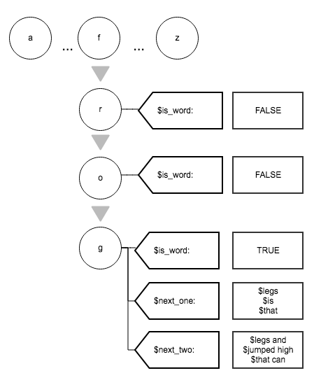

### Submission by Connor Lenio. Email: cojamalo@gmail.com
Completion Date: Aug 6, 2017

* * *

```{r settings, include=FALSE}
knitr::opts_chunk$set(echo = TRUE, fig.align='center', message = FALSE, warning=FALSE)
setwd('/Users/cojamalo/Documents/JHU Capstone/')
```

```{r, include=FALSE}
generate_report = function(data, data_grams) {
    print(paste("The number of lines in the data is:", format(nrow(data), big.mark = ",")))
    guess1 = sum(str_count(data$value, " ")) + nrow(data)
    guess2 = sum(str_count(data$value, "\\W+"))
    print(paste("The estimated total word count in the data is around", format(guess1, big.mark=",") ,"to", format(guess2, big.mark=","), "words"))
    print(paste("The estimated words per line of the data is", format(guess1/nrow(data),digits=4), "to", format(guess2/nrow(data),digits=4), "words per line"))
    unigrams = data_grams %>% filter(n_gram == "one") %>% nrow
    bigrams = data_grams %>% filter(n_gram == "two") %>% nrow
    trigrams = data_grams %>% filter(n_gram == "three") %>% nrow
    print(paste("There are", format(unigrams, big.mark = ","), "unique words present in this source"))
    print(paste("There are", format(bigrams, big.mark = ","), "unique bigrams present in this source"))
    print(paste("There are", format(trigrams, big.mark = ","), "unique trigrams present in this source"))
}
```

```{r, include=FALSE}
make_freq_plot = function(sample_df, n_gram_n = "one", color='red') {
    sample_df %>%
            filter(n_gram==n_gram_n) %>%
            top_n(20) %>%
            mutate(word = reorder(token, n)) %>% # This is useful as I have had to reorder columns before
            ggplot(aes(x=word, y=n)) +
            geom_col(fill = color) +
            coord_flip() +
            theme(plot.title = element_text(hjust = 0.5)) +
            labs(title = "Frequency of Top 20 Words/Phrases", y = "", x = "Frequency")
}

make_wordcloud = function(sample_df, n_gram_n = "one", ...) {
    # Create a wordcloud for the values in word_freqs
    wordcloud(words = (sample_df %>% filter(n_gram == n_gram_n))$token, freq = (sample_df %>% filter(n_gram == n_gram_n))$n, ...)
}
```

## Goal

The following markdown file documents the initial progress on John Hopkins University's Data Science Capstone course hosted by Coursera. The goal of the project is to construct a working predictive text web app that functions like the predictive text features found in keyboard apps such as SwiftKey and Gboard. Topics covered in this document include importing, cleaning, and tokenizing the text data supplied for the project, an exploratory analysis of the processed data, and my initial thoughts and assumptions for constructing the final app and predictive text algorithm. 

* * *

## Setup

### Load packages

```{r load, message=FALSE, warning=FALSE}
library(data.table);library(tidyverse);library(stringr);library(qdap);library(tm);library(tidytext);library(wordcloud)
library(splines); library(pander)
```
<br>


## Import the data

Three source text files were supplied by the course. Each source represents sampled text from news, blog, and tweet sources respectively. The `read_lines` function was used to import the data into a data frame where one row represents one line of text from the original file.
```{r import-raw}
news = read_lines("./en_US/en_US.news.txt") %>% tbl_df
blogs = read_lines("./en_US/en_US.blogs.txt") %>% tbl_df
tweets = read_lines("./en_US/en_US.twitter.txt") %>% tbl_df
```
<br>

## Clean and tokenize the data

Before performing exploratory data analysis, the data was processed into to a more useful form for constructing the final model. The final model will suggest words as one types and, thus, individual words and their neighbors need to be identified in the data. The individual words, or tokens were extracted from each line of data. Each line of data was processed, removing unwanted characters and tokenized to isolate unigrams, bigrams, and trigrams (such as "the", "the dog", and "the dog runs"). The detailed process is outlined at [Importing, Cleaning, and Tokenization of the Text Data](https://cojamalo.github.io/DATA-JHU-Capstone-Text-Prediction/import_clean_tokenize.html).

These processes were run on an AWS EC2 RStudio Server to improve processing time for the large amount of data. The data was exported from that server as a CSV file:
```{r import-processed}
news_grams = fread("./From Server/news_grams.csv", showProgress = FALSE, stringsAsFactors = FALSE) %>% tbl_df
blogs_grams = fread("./From Server/blogs_grams.csv", showProgress = FALSE, stringsAsFactors = FALSE) %>% tbl_df
tweets_grams = fread("./From Server/tweets_grams.csv", showProgress = FALSE, stringsAsFactors = FALSE) %>% tbl_df
```
<br>

To view the combined data, the following script was run to aggregate the counts of the tokens for all three data sources (These commands were also run with an AWS EC2 RStudio Server to save time and transferred to this session as a CSV file).
```{r import-all-processed}
## Command run on RStudio server
#all_grams = news_grams %>% bind_rows(blogs_grams, tweets_grams) %>% group_by(n_gram, token) %>% summarize(n = sum(n))
## Data imported to current session
all_grams = fread("./From Server/all_grams.csv", showProgress = FALSE, stringsAsFactors = FALSE) %>% tbl_df
```
<br>

## Exploratory Data Analysis

To begin exploring features of the data, statistics for each data source are computed using `generate_report` (See Appendix A for the code). Word counts are estimated by trying to isolate individual words using two different methods of tagging whitespace in the data.

### For the news source

The news source features lines from news articles featuring one to many sentences per line. The document is estimated to have 35 million total words and only about 300,000 unique words were extracted. This fact indicates there are many repeated words and phrases in the data. This trend is present in all the sources and tracking these repeated phrases and words will be the basis for the predictive text model.
```{r news-report, echo=FALSE}
print("Two sample lines from the data:")
head(news$value,2)
generate_report(news, news_grams)
```
<br>

### For the blogs source

The blog's source features lines from blogs featuring one to many sentences per line. While the blog's data does not the greatest number of unique individual words, it does feature the highest number unique bigrams and trigrams.
```{r blogs-report, echo=FALSE}
print("Two sample lines from the data:")
head(blogs$value,2)
generate_report(blogs, blogs_grams)
```
<br>

### For the tweets source

The tweets source features lines from tweets featuring one to many sentences per line. The tweets data has the greatest number of lines as well as the largest number of unique words at 577,524 words.
```{r tweets-report, echo=FALSE}
print("Two sample lines from the data:")
head(tweets$value,2)
generate_report(tweets, tweets_grams)
```
<br>

### For all three sources combined

The predictive model will be constructed from the information provided by all three source combined together into a large, single corpus, `all_grams`. From processing all of the source data, 971,236 unique words were extracted. Not all of these words will be used in the model, however, as certain quality measures will have to be used to ensure all the words are real and useful to predict.

```{r break-by-gram}
unigrams = all_grams %>% filter(n_gram == "one") 
bigrams = all_grams %>% filter(n_gram == "two")
trigrams = all_grams %>% filter(n_gram == "three") 
```


```{r all-report, echo=FALSE}
print(paste("The total number of lines of text data from combining all three data sources is", format(sum(nrow(news), nrow(blogs), nrow(tweets)),big.mark=",")))
print(paste("There are", format(unigrams %>% nrow, big.mark = ","), "unique words present in all sources combined"))
print(paste("There are", format(bigrams %>% nrow, big.mark = ","), "unique bigrams present in all sources combined"))
print(paste("There are", format(trigrams %>% nrow, big.mark = ","), "unique trigrams present in all sources combined"))
```
<br>

## Visualizing top words

So what are the most common words found in the data? The following plots were made with the functions in Appendix B.

The most common unigrams are mainly prepositions and conjunctions such as "the" and "and":
```{r plots-1, echo=FALSE, cache=TRUE}
make_freq_plot(all_grams)
make_wordcloud(all_grams, max.words=80, colors=brewer.pal(5, "Reds")[3:5], scale=c(4,0.75))
```
<br>

The most common bigrams are mainly parts of prepositional phrases such as "of the":
```{r plots-2, echo=FALSE, cache=TRUE}
make_freq_plot(all_grams, "two", "green")
make_wordcloud(all_grams, "two", max.words=80, colors=brewer.pal(5, "Greens")[3:5], scale=c(3,0.5))
```
<br>

The most common trigrams are common prepositional, adjective, verb phrases such as "as well as","a lot of", and "I want to":
```{r plots-3, cache=TRUE, echo=FALSE}
make_freq_plot(all_grams, "three", "blue")
make_wordcloud(all_grams, "three", max.words=80, colors=brewer.pal(5, "Blues")[3:5], scale=c(2.5,0.25))
```
<br>

## Controlling Token Quality

The data manipulation process must control for the quality of the tokens used in the final model. By sampling the source data completely, fake words, rare words and names, and misspelled words are included in the full token data in `all_tokens`. Thus, these undesirable words must be eliminated from the data prior to constructing the model.

As an example, here is a sample of the least frequent words in `all_grams`:
```{r sample, results='asis', echo=FALSE}
set.seed(123)
all_grams %>% filter(n_gram=="one",n==1) %>% sample_n(10) %>% pandoc.table
```
<br>

These words are not useful for prediction. In order to screen these problem words out, more frequent words will be prioritized. The logic is that more frequent words are objectively more likely to be real words that are in common use and are practical targets for prediction. To determine a quality cutoff based on frequency, each n-gram data frame is analyzed in combination with an English dictionary of over 500,000 words provided by Github user `dwyl` who sourced them from an infochimps.com article. 

```{r construct-dict}
# Construction of an English reference dictionary
# Source: https://github.com/dwyl/english-words
eng_dict1 = read_lines('./eng_dict1.txt')
eng_dict2 = read_lines('./eng_dict2.txt')
eng_dict = c(eng_dict1, eng_dict2) %>% unique
```
<br>

For this example, only the analysis applied to `unigrams` is shown, but a similar process will be applied to the `bigrams` and `trigrams` data frames before making the final model.  First, the proportion of each word that matches a dictionary word for each frequency is determined. All words in `unigrams` are converted to lowercase for this process since the casing is not important to this quality check process just whether the word is in the dictionary. The data is limited to just those tokens that appeared 500 or less unique times in the data. Then, a high-order polynomial regression is fit to the data to estimate the relationship between frequency and whether the token is in the dictionary.
```{r qual-check, cache=TRUE}
# The percentage of each word that matches a dictionary word for each frequency is determined
qual_by_n = unigrams %>% mutate(in_dict = tolower(token) %in% eng_dict) %>% group_by(n) %>% summarize(perc_in_dict = mean(in_dict), n_in_group = n()) %>% arrange(desc(n)) 

# Filter the max frequency to consider
plot_dat = qual_by_n %>% filter(n <= 500)
# Fit polynomial regression to estimate relationship between frequency and percent in dictionary
fit_ns <- lm(perc_in_dict ~ n + ns(n,15), plot_dat); pred_ns <- predict(fit_ns, type="response")
# Set cutoff and predict the percent in dictionary for that cutoff
cutoff_n = 80
accuracy = predict(fit_ns, newdata=data.frame(n=cutoff_n), type="response")
# Plot results
ggplot(plot_dat, aes(x=n, y=perc_in_dict)) +
    geom_point() + 
    geom_line(aes(y = pred_ns), color = "#00BFC4", lwd = 1) + 
    geom_vline(xintercept=cutoff_n, color ="#F8766D") +
    geom_hline(yintercept=accuracy, color ="#F8766D") +
    geom_text(aes(0.1,accuracy,label = format(accuracy, digits = 3), vjust = -1), color ="#F8766D") +
    theme(plot.title = element_text(hjust = 0.5)) +
    labs(title = "Proportion of Tokens in Dictionary by Frequency of Tokens in the Data", y = "Proportion of Tokens in Dictionary", x = "Frequency of Token in Data")
```

The plot displays the polynomial regression line and a percent tokens in dictionary estimate for the given cutoff. For instance, a cutoff frequency equal to 80 predicts that 75% of the tokens that appear eighty times in the data will match words in the English dictionary. The goal here is not to make a perfect prediction nor to know exactly what a good cutoff is. Rather, by plotting the data, one can confirm that the quality of the tokens, as estimated by the proportion of tokens in the dictionary, does increase with its frequency. A cutoff such as 80 will be used to filter out undesirable tokens since as the frequency of a token's frequency in the data decreases below 80, the likelihood of the token not appearing in the dictionary, and, thus, not being a practical target for prediction, increases rapidly.

<br>

## Predictive Text Modelling Overview

A Markov Chain structure is useful in text prediction. A Markov Chain is a mathematical model where predictions are made only knowing the current state of a system. In this case, the current state is the current sequence of characters or words the user has entered in the text prediction Shiny application. In order to model a Markov Chain model, each word will have to relate to other words according to the probability of what word or letters typically come next. 

The data has been processed to construct such a model. The `unigrams` data provides relationships between characters since each word is an instance of one string of characters. For example, the word "apple" demonstrates that at some probability the letter "a" is followed by "p", "p" followed by "p", "p" followed by "l", etc. The `bigrams` data provides relationships between one word and its following word and the `trigrams` data provides relationships between one word and its two following words. This information can be used to make a Markov Chain as the frequency of each of these words in the data provides the probability information necessary to predict the next word or letter given an input word. Input words that are not in the final model can still generate predictions by suggesting nearest spellings or by providing the most probable next words given any words.

One way to construct this model is to use reinforcement learning. However, for this project, I currently plan to use a trie, or radix tree structure to model the Markov Chain. Each character will be stored as a key (node) using nested lists in R. When a word or character string is passed to the trie, each character becomes a key or list name to access deeper nested lists. For each character, additional data will be stored such as whether the characters entered so far is an actual word and what the next most likely words are for the given word.

For those unfamiliar with the trie data structure, the following chart illustrates an example if one passed the word, "frog", to the model. At the top level of the nested list are all the possible starting characters for unigrams in the model. Since "frog", starts with "f", the algorithm moves to all possible characters when "f" is the first character. In this case, "r" is selected for the "fr" in "frog". "fr" is not a word, so the is_word Boolean is FALSE. The algorithm traverses the nested list until all the characters in "frog" are passed to the trie. after reaching "g", the algorithm returns all the data associated with the `trie$f$r$o$g` list. Three of the highest probability one and two word strings are present at this node and the algorithm can pass them as predictions to the user. Depending on the algorithm settings, three sample prediction options for "frog" would be "legs", "is", and"legs and".

```{r trie-ex, echo=FALSE, out.width='66.6%', eval=TRUE}

```

Using a Markov Chain model stored in a trie structure is the current plan for the final project. The plan is subject to change as implementation and testing occur. 


## Appendix A: Summary Statistic Function
```{r append-a}
generate_report = function(data, data_grams) {
    print(paste("The number of lines in the data is:", format(nrow(data), big.mark = ",")))
    guess1 = sum(str_count(data$value, " ")) + nrow(data)
    guess2 = sum(str_count(data$value, "\\W+"))
    print(paste("The estimated total word count in the data is around", format(guess1, big.mark=",") ,"to", format(guess2, big.mark=","), "words"))
    print(paste("The estimated words per line of the data is", format(guess1/nrow(data),digits=4), "to", format(guess2/nrow(data),digits=4), "words per line"))
    unigrams = data_grams %>% filter(n_gram == "one") %>% nrow
    bigrams = data_grams %>% filter(n_gram == "two") %>% nrow
    trigrams = data_grams %>% filter(n_gram == "three") %>% nrow
    print(paste("There are", format(unigrams, big.mark = ","), "unique words present in this source"))
    print(paste("There are", format(bigrams, big.mark = ","), "unique bigrams present in this source"))
    print(paste("There are", format(trigrams, big.mark = ","), "unique trigrams present in this source"))
}
```


## Apendix B: Plotting Functions
```{r append-b}
make_freq_plot = function(sample_df, n_gram_n = "one", color='red') {
    sample_df %>%
            filter(n_gram==n_gram_n) %>%
            top_n(20) %>%
            mutate(word = reorder(token, n)) %>% # This is useful as I have had to reorder columns before
            ggplot(aes(x=word, y=n)) +
            geom_col(fill = color) +
            coord_flip() +
            theme(plot.title = element_text(hjust = 0.5)) +
            labs(title = "Frequency of Top 20 Words/Phrases", y = "", x = "Frequency")
}

make_wordcloud = function(sample_df, n_gram_n = "one", ...) {
    # Create a wordcloud for the values in word_freqs
    wordcloud(words = (sample_df %>% filter(n_gram == n_gram_n))$token, freq = (sample_df %>% filter(n_gram == n_gram_n))$n, ...)
}
```

